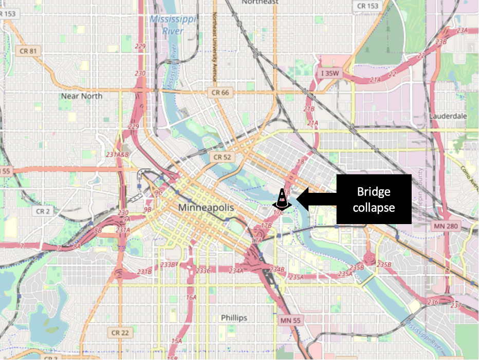
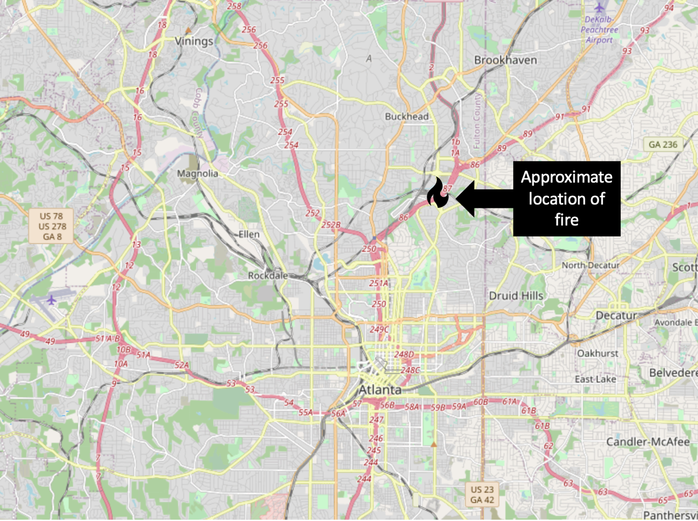

# Literature {#litreview}
The resilience and connectivity of transport networks are a long-studied topic
within transportation engineering in both theoretical and practical contexts.
Within this long history however, there is variability in how scholars define
resiliency. There are three basic definitions that researchers have used:

•	*Resilience through Resistance*: Resilient transportation networks have few
and manageable vulnerabilities. This is typically addressed through robust
facility-level engineering and risk management e.g., [@bradley2007].
•	*Resilience through Recovery*: Resilient transportation networks are able to
be repaired and returned to normal service without inordinate delay. This is
accomplished through effective resource allocation and incident management
e.g., [@zhang2016]. 
•	*Resilience through Operability in Crisis*:
Resilient transport networks are able to operate effectively with damaged or
unusable links. It is this definition that is most relevant in the context of
this study. 

These definitions are not entirely mutually exclusive, and many
researchers apply more than one definition in their work. For example, knowing
where systemically critical or vulnerable links are will help in allocating
maintenance resources. At the same time, the approach to identifying critical
facilities implied by one of these definitions is not always compatible with the
other definitions, and making distinctions between them is important [@rogers2012]. A bridge highly vulnerable to failure may be located on a
little-traveled and systemically unimportant side street. The motivation of this
research is to identify *systemically* critical facilities, and therefore we
primarily consider literature using the third definition.

Professionals have adopted use of the Four R’s as a means to predict some form
of resilience on a highway network. The Four R’s include: rapidity, redundancy,
robustness, and resourcefulness. Here, rapidity is inversely related to the
closure time and is used to measure how quickly a road can recover from a
setback. Redundancy can be measured by the additional time or distance a user
has to travel when a route is broken. Greater amounts of time or distance lower
the overall redundancy. Robustness is the inverse of risk and represents the
overall strength of the system as a whole. Resourcefulness, the last of the Four
R’s, is the ability to find quick solutions in a network. An attempt will be
made to identify the first time that these terms surface in the reviewed
literature.

We begin this review first by examining the study conducted by AEM on behalf of
UDOT to identify vulnerable sections on the I-15 corridor. We then consider
observations learned from systemic changes to networks and populations under
real-life crisis events. We then consider previous attempts in the academic
literature to evaluate real and fabricated transportation networks.

## Identifying Critical Links in Utah
AEM worked with UDOT to develop an I-15 Corridor Risk and Resilience (R&R) Pilot
in 2017. This project had a seven-step plan to understand the impact of physical
threats to the Utah transportation network, specifically looking at two sections
along I-15. These steps include asset characterization, threat characterization,
consequence analysis, vulnerability assessment, threat assessment,
risk/resilience assessment, and risk/resilience management. From these steps AEM
was able to provide recommendations to UDOT that would improve resiliency along
the corridor based on the criticality of each segment at risk.

AEM considered nine physical threats which include: earthquake, flood (scour),
flood (overtopping/debris), fire (wildland), railway-proximity, oil/gas/water
pipeline-proximity, and water canal/ditch-proximity. Once threat types were
determined, the location of threat-asset pairs along I-15 were found by
intersecting GIS data layers. This process allowed AEM to estimate critical
informaiton about each threat-asset pair that could be used to determine an
assests risk level.

The AEM R&R report provides a template going forward for identifying links at
risk, following the first definition of a resilient transportation network from
the Four R's. AEM also attempts to identify which links are most critical,
assigning a “criticality” score to the network based on analysis outcomes. A key
observation of these criticality scores is that no accommodation is made for
available alternate routes or network redundancy should a link become
unavailable. The third definition of reiliency from the Four R's implies that
alternate routes must be considered, something which AEM fails to do [@aem2017].

## Review of Other Crisis Events
Two major crisis events in the last fifteen years have given researchers an
important opportunity to study what happens to transportation behavior when
critical links are suddenly disabled for an extended period. These events are
the collapse of the I-35W bridge collapse in Minneapolis, Minnesota and the I-85
/ Piedmont Road fire and bridge collapse in Atlanta, Georgia.

### I-35 Bridge Collapse
On August 1, 2007, the I-35 bridge over the Mississippi River in downtown
Minneapolis collapsed during rush hour. The bridge, which was undergoing
maintenance, had been rated as structurally deficient and fracture critical,
meaning that failure of one member would cause structure failure. The collapse
occurred during rush hour traffic, and the bridge was additionally loaded with
approximately 300 tons of maintenance equipment [@schaper2017]. There were 13
fatalities, approximately 140 injuries, and abrupt disruption to roughly 140,000
average daily trips (ADT) over the bridge [@zhu2010]. The complicated nature of
the demolition and repair meant this systemically critical link would be missing
for approximately 14 months. The approximate location of the bridge, one of two
major routes over the Mississippi River, can be seen in Figure \@ref(fig:i35map).

```{r i35map, fig.cap="Location of I-35 W Bridge Collapse.", out.width='100%', echo = FALSE}

```
[@zhu2010] conducts a travel survey to provide a more in-depth analysis of
important data and traffic changes surrounding the I-35W bridge collapse in
2007. The article uses a methodology that attempts to identify mode-choice and
other behavioral changes of survey respondents. The authors analyze data looking
for variations in ADT, as well as Origin-Destination matrices. Importantly, they
analyze some pre-disaster data in their work. The authors provide evidence which
indicates that drivers are reluctant to make mode choice changes, rarely doing
so. This is likely due to reasons such as finances, time, or perceived
difficulty of navigating a new mode of transport. At the same time, some drivers
change destinations when faced with increased travel times.

[@levinson2010] explores traffic behavior and changes in the wake of major
network disruptions such as those that occurred in Minnesota. The authors
identify unique behavior post disaster using GPS tracking data, survey data from
the post disaster phase, and other aggregate data from surrounding freeways and
traffic devices. The gathered data was analyzed to track changes in ADT over
bridges and alternative routes in the area after the disaster as well as after
mitigation was complete. Levinson and Zhu provide increased understanding about
how a network's operability changes during a post-crisis environment.

[@xie2011] attempt to determine economic costs in the form of increased travel
time of the 2007 I-35W bridge collapse using a scaled down travel demand model.
The authors used a simplified version of the SONG 2.0 travel demand model that
had been developed for the Twin Cities area to determine vehicle hours traveled
(VHT) and vehicle kilometers traveled (VKT). They also calculate the
accessibility for each zone from jobs to workers, and from workers to jobs of
the network using employment, residency, and transportation cost data. Using
this simplified travel model, the authors estimate that the bridge collapse cost
the Twin Cities approximately $75,000/day in increased travel times.

### I-85 / Piedmont Bridge Road Fire
In Atlanta, Georgia, a section of an I-85 bridge collapsed due to a massive fire
under the bridge on March 30, 2017. The fire, which was started by a homeless
man, grew quickly because of improperly stored construction materials under the
bridge. The approximate location of the bridge collapse caused by the fire can
be seen in Figure \@ref(fig:i85map); the damaged link is at a critical point downstream of a
merge point between two expressway facilities (GA-400 and I-85) bringing
commuter traffic in from the suburbs of northern Fulton and Gwinnett Counties.

```{r i85map, fig.cap="Location of I-85 / Piedmont Roadd Fire in Atlanta.", out.width='100%', echo = FALSE}
#\@ref(fig:i85map)

```

As a result of the fire, the highway, which had an average daily traffic count
(ADT) of 243,000, was closed in both directions for a period of about two
months. This closure led to a 30% increase in traffic volumes across the entire
downtown network, with increased congestion on side streets [@hamedi2018].
Additionally, the Metropolitan Atlanta Rapid Transit Authority (MARTA),
experienced a 20% increase in ridership, likely because many commuters made mode
choice and route changes. To mitigate this, headways between busses and trains
were decreased to allow greater passenger volume. MARTA was able to add 142,000
rail miles, 1,100 train hours, 8,202 bus miles, 512 bus hours, and 2,463 parking
spaces in park and ride lots to help further mitigate the situation [@marta2017],
[@marta2018]. It is likely that MARTA’s efforts to mitigate passenger volumes
greatly influenced the onset of negative effects of the bridge fire.

The section of I-85 that was closed impacted a large, upper income demographic
in the greater Atlanta area who commuted across the bridge. This area was
drastically impacted by the disaster. As a result, the Georgia Department of
Transportation (GDOT) along with the Governor created a $3.1 million incentive
program to help motivate project completion ahead of schedule. The bridge was
originally set to be closed for a period of 10 weeks, however, it re-opened
after just 6 weeks, with construction being completed a month ahead of schedule.
The accelerated finishing date was estimated to have saved approximately $27
million in user and travel time costs [@GDOT2017]. GDOT’s efforts to open the
bridge quickly after its collapse aided in abating negative user costs due to
significant travel time delays that surfaced due to changes in route choice and
assignment.

## Attempts to Evaluate Systemic Resiliency
A number of researchers have conducted studies where they construct real or
fabricated transportation networks, eliminate or degrade links in the network,
and evaluate the changes the loss of these links introduced into some measure of
network performance. [@berdica2002] attempts to identify, define and
conceptualize vulnerability by envisioning analyses conducted with several
vulnerability performance measures including travel time, delay, congestion,
serviceability and accessibility. Here, Berdica defines accessibility as the
ability for users to travel between origins and destinations for any number of
reasons. She then uses the performance measures to define vulnerability as the
level of reduced accessibility due to unfavorable operating conditions on the
network. In particular, Berdica identifies a need for further research toward
developing a framework capable of investigating reliability of transportation
networks.

In this section we will examine several attempts by numerous researchers to do
precisely this using different measures of network performance. A consolidation
of this discussion is summarized in Table 2, namely the methods that different
researchers have used in examining network performance under duress. The
measures can be consolidated in to three basic families: 

-	*Network Connectivity* considers how isolated nodes of a network become when
links are damaged. 

-	*Travel Time analysis* considers how removing or degrading a link affects the
shortest cost paths between network points.

-	*Accessibility analysis* considers how the population using the network has
their daily patterns affected by the damaged network.

We discuss studies within each family in turn.

```{r authortable, echo = FALSE}
library(knitr)
library(readxl)
authortable <- read_xlsx("images/author_summary.xlsx")
kable(authortable)
```

### Network Connectivity
Graph theory is the mathematical study of networks of nodes connected by edges
(links). Within this discipline are the related concepts of network
vulnerability and connectivity that have been accessed by researchers. In these
studies, researchers tend to define critical links as those that connect to many
other nodes (directly or indirectly), or as links whose loss isolates a number
of nodes from the rest of the network.

[@abdel2007] explores multi-layered graph theory to attempt to
asses transportation network criticality. The researchers develop a weighting
scheme based on interconnectedness between three layers of the transportation
system: the power, communication, and physical road networks. This scheme is
applied to and combined with data gathered using an Origin-destination matrix to
determine criticality of road network facilities based on several proximity and
link and node volume criteria. [@abdel2007] attempts to determine
resilience through resistance by identifying a metric for examining the
interrelatedness of the three systems, all of which are vital to proper function
of the transportation network. Their methodology highlights some of the
advantages to using a multi-layered graph approach for determining levels of
resiliency of transportation networks.

[@agarwal2011] utilizes a systems approach to identify vulnerabilities
based on connectivity. Their methodology uses a graph model to determine a
hierarchical representation of a transportation network that could be analyzed
for vulnerabilities. To do this, several concepts surrounding vulnerability are
defined, including robustness and risk. Agarwal also outlines three criteria to
help determine how facility failure affects a system. These were: form of the
system, level of demand of the system, and level of systemic preparedness. These
criteria provide a framework for network analysis that allows for identification
of vulnerable scenarios and modification or adaption of involved facilities to
be carried out. Agarwal’s framework best fits the definition of resilience
through resistance due to the way it can identify critical facilities and allow
for mitigation moving forward.

[@ip2011], attempt to combine graph theory with friability in order to determine
criticality of links or hub cities. Friability is defined as the reduction of
network capacity caused by removing a link or node. The methodology presented
relies on the ability to determine the weighted sum of the resilience of all
nodes based on the weighted average of connectedness with other city nodes in
the network. The authors determine that the recovery of transportability between
two cities largely depends on redundant links between nodes. Ip and Wang also
comment that most traffic managers are more concerned with the friability of
single links rather than the friability of multiple links or an entire system.
The author's hypothesis closely matches resilience through operability because
the methodology seeks to determine resilience of a network that already has
damaged links and nodes. Their main contribution to the field of transportation
research is the idea of friability, that a network can break down for any number
of reasons, of which transportation networks generally appear most susceptible
to attack or disaster.

[@vodak2019] introduces a method to quickly identify critical links in a network by searching for the shortest cycles, or independent loops in the network. The algorithm progressively damages one or more links between iterations to determine if nodes become isolated, or cut off from the network. The authors use isolation as a measure of network vulnerability and connectedness. If a node becomes easily isolated or has a higher likelihood of becoming isolated, then there is a higher degree of vulnerability present in the network. Vodak’s work is significant because the novel algorithm is capable of processing upwards of 1000 links and nodes while effectively identifying vulnerabilities in the network. This ability makes the algorithm a valuable tool for resilience research at the regional and statewide levels.

### Changes in Travel Time
Graph theory based approaches to resiliency largely consider whether the network nodes become isolated after links are degraded or removed. Though isolation is an important problem, transportation networks often have multiple redundant paths between nodes; however, some of these paths may be considerably longer. It is therefore useful to determine how the path cost changes even if the nodes involved are still reachable on the network.

[@peeta2010] constructs a model to evaluate the most efficient allocation of highway maintenance resources prior to an earthquake with the potential to disrupt transport network connectivity. The authors create a simplified graph of Istanbul, Turkey with 30 attributed links and 25 nodes, with each link having a specified failure probability that could be mitigated with investment. Using this graph, the researchers evaluate what happened to travel times between the origin-destination pairs as links from this network were disabled using a Monte Carlo simulation. The authors showed that this problem is tractable with a locally optimal solution existing. 

[@ibrahim2011] provides an alternative heuristic approach for determining vulnerability of infrastructure by estimating the cost of single link failure based on the increase in shortest path travel time due to increased congestion levels. Ibrahim proposes a hybrid heuristic approach that calculates the traditional user-equilibrium assignment for finding the first set of costs, and then fixes those costs for all following iterations to determine the effects of failure on overall travel time of the system. Ibrahim’s novel heuristic approach is important because of its ability to drastically reduce computation time for larger networks while providing accurate results that closely match results found from traditional modeling methods.

[@omer2013] proposes a methodology for assessing the resiliency of physical infrastructure during disruptions. To do this, the authors use a network model to build an origin-destination matrix that allows initial network loading and analysis. Omer’s model uses several metrics, but the main metric used to determine resiliency is the difference in travel time between a disturbed and undisturbed network. Omer’s framework is applied to an actual network between New York City and Boston for analysis. Changes in demand, travel time, mode choice and route choice are tracked for analysis. Omer’s framework supports operability of transportation networks due to the way it analyzes networks experiencing suboptimal circumstances. The authors work identifies key parameters that should be measured to assess resiliency during disruptive events.

[@jaller2015] seeks to identify critical infrastructure based on increased travel time, or reduced capacity due to disaster. The proposed methodology utilizes user-equilibrium to determine proper initial network loading. Then, the shortest path between one origin and one destination can be identified. To implement damage to the network, a link is cut, and then the next shortest path is found. This process is followed for all links in the system in order to determine a sense of the criticality of each link to network resiliency. The analysis is carried out for each O-D pair, and the nodes with greatest change in travel time are determined to be the most critical. Jaller’s methodology allows traffic managers to identify critical paths for mitigation purposes before the occurrence of disaster through careful analysis.

### Changes in Accessibility
Accessibility refers to the ease with which individuals can reach the destinations that matter to them; this is an abstract idea but one that has been quantified in numerous ways. [@dong2006] provides a helpful framework for understanding various quantitative definitions of accessibility that we will simplify here. The most elementary definition of accessibility is whether a destination is within an isochrone, or certain distance. This measure is often represented as a count, e.g., the number of jobs reachable from a particular location within thirty minutes travel time by a particular mode. Mathematically,

$$A_i = \sum_{j} X_jI_{ij}$$ where $I_{ij} = 1$ if $d_{ij} < D$ and $I_{ij} = 0$ if $d_{ij} > D$

where the accessibility A at point i is the sum of the all the jobs or other
destinations $X$ at other points $j$. $I_{ij}$ is an indicator function equal to zero if
the distance between the points $d{_ij}$ is less than some asserted threshold (e.g.,
thirty minutes of travel time). By relaxing the assumption of a binary isochrone
and instead using the distance directly, we can derive the so-called gravity
model,

$$ A_i = \sum_{j} X_jf(d_{ij})$$
where the function $f(d_{ij})$ is often a negative exponential with a calibrated
impedance coefficient. An extension of the gravity model is to use the logsum
term of a multinomial logit destination choice model,

$$ A_i = ln\sum_{j} \beta_d(d_{ij}) + X_j\beta$$
Where the parameters β are estimated from choice surveys or calibrated to
observed data. The logsum term has numerous benefits outlined by [@handy1997]
and [@xiangdong2007]; namely, the measure is based in actual choice theory, and can
include multiple destination types and travel times by multiple different modes.
Accessibility measures of any kind are important in resiliency analysis because
a damaged transport network will limit the ability of people to access the full
variety of destinations they otherwise would.

[@guers2004] provide a review of accessibility measures such as
those above up to 2004. Of the papers they reviewed, Vickerman (1974), Ben-Akiva
and Lerman (1979), Geurs and Ritsema van Eck (2001) used isochrone type methods,
Stewart (1947), Hansen (1959), Ingram (1971), and Vickerman (1971), and Anas
(1983) used gravity, and Neuburger (1971), Leonardi (1987), Williams and Senior
(1978), Koenig( 1980), Anas (1983), Ben-Akiva and Lerman (1985), Sweet (1997),
Niemier (1997), Handy and Niemier (1997), Levine (1998), and Miller (1999) used
or suggested logsums. They highlight the importance of using person-based
measures such as these in evaluating network vulnerability and resiliency.

[@taylor2008] also examines accessibility as a way to analyze network
vulnerabilities, mainly through logsum analysis. Taylor begins by explaining the
concepts of vulnerability and accessibility, which further help to explain their
interrelatedness and key distinctions. He then applies logsum analysis to
provide a framework for solving problems of accessibility. Taylor’s method for
identifying vulnerabilities involves modeling travel demand, network topology,
capacity, and road geometry in a manner that closely resembles a graph network.
He does make one key distinction between links and nodes, however. A Node is
vulnerable if link loss to that node diminishes its accessibility, while a Link
is critical if its loss significantly diminishes accessibility within the
network. One drawback to Taylor’s methodology at this point, is that it is
intended to be used after critical locations have been identified.

## Summary
The lessons learned from the events in Minneapolis and Atlanta demonstrate that
when transportation networks are damaged or degraded by link failure, multiple
changes result. Traffic diverts to other facilities and other modes, and some
people make fundamental changes to their daily activity patterns, choosing new
destinations or eliminating trips entirely. Numerous other researchers have
identified methodologies to capture the effects, or at least the costs, of these
potential changes in modeled crisis events. We are able to learn from past and
current methodologies to create a functional methodology on a state-wide level.