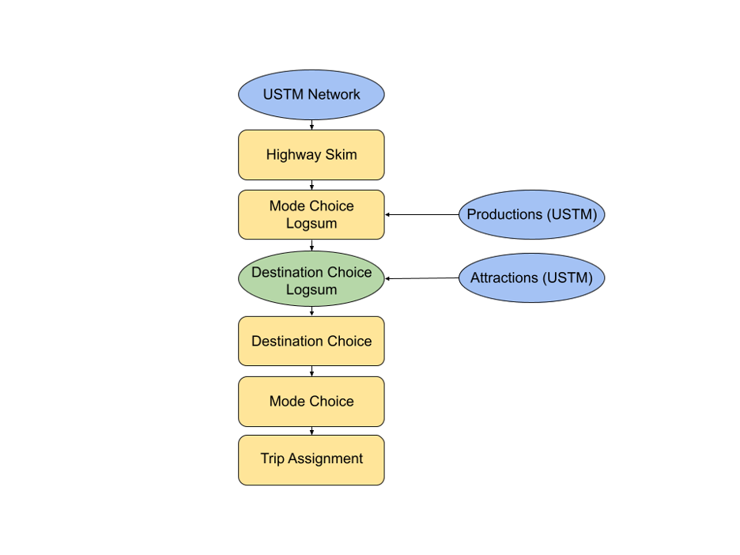

# Methodology {#methodology}

The objective of this study is to evaluate the relative systemic criticality of 
highway links using a model sensitive to changes in route path, destination choice,
and mode choice. 

## Model Design
The overall model framework is presented in Figure \@ref(fig:framework), and is
designed to capture the utility-based accessibility for a particular origin 
zones $i$ and trip purpose $m$. The model begins with a travel time skim
procedure, to determine the congested travel time from zone $i$ to zone $j$ by
auto as well as the shortest network distance for non motorized modes. The
transit travel time skim is fixed, assuming that transit infrastructure would
not be affected by changes to the highway network. Throughout this section,
lower-cased index variables $k$ belong to a set of all indices described by the
corresponding capital letter $K$

```{r framework, out.width="75%", fig.align="center", fig.cap = "Model framework.", echo = FALSE}

```

With the travel time $t_{ijk}$ for all modes $k \in K$, the model computes
mode choice utility values. The multinomial logit mode choice model describes
the probability of a person at origin $i$ choosing mode $k$ for a trip to
destination $j$:
\begin{equation}
\mathcal{P}_{ijm}(k) = \frac{\exp(f(\beta_{m}, t_{ijk}))}{\sum_{K}\exp(f(\beta_{m}, t_{ijk}))}
  (\#eq:mcp)
\end{equation}
The log of the denominator of the this equation is called the 
mode choice logsum, $MCLS_{ijm}$ and is a measure of the travel cost by all 
modes, weighted by utility parameters $\beta_m$ that may vary by trip purpose.

The $MCLS$ is then used as a travel impedance term in the multinomial logit 
destination choice model, where the probability of a person at origin $i$
choosing destination $j \in J$ is
\begin{equation}
\mathcal{P}_{im}(j) = \frac{\exp(f(\gamma_{m}, MCLS_{ijm}, A_j))}{\sum_{J}\exp(f(\gamma_{m}, MCLS_{ijm}, A_j))}
  (\#eq:dcp)
\end{equation}
where $A_j$ is the attractiveness --- represented in terms of socioeconomic activity
--- of zone $j$. As with mode choice, the log of the denominator of this model is the destination
choice logsum, $DCLS_{im}$. This quantity represents the value access to all destinations
by all modes of travel, and varies by trip purpose. 

The $DCLS_{im}$ measure is relative, but can be compared across scenarios. The 
difference between the measures of two scenarios 
\begin{equation}
\Delta_{im} = DCLS_{im}^{\mathrm{Base}} - DCLS_{im}^{\mathrm{Scenario}}
  (\#eq:deltas)
\end{equation}
however, provides an estimate of the accessibility lost when $t_{ij\mathrm{drive}}$
changes due to a damaged highway link. This accessibility change is *per trip*, 
meaning that the total lost accessibility is $P_{im} * \Delta_{im}$ where $P$ is
the number of trip productions at zone $i$ for purpose $m$. This measure is
given in units of dimensionless utility, but the mode choice cost coefficient 
$\beta$ provides a conversion factor between utility and cost. The total financial
cost of a damaged link for the entire region for all trip purposes is
\begin{equation}
\mathrm{Cost} = \sum_{I}\sum_{M} -1 / \beta_{\mathrm{cost},m} * P_{im} \Delta_{im}
  (\#eq:totalcost)
\end{equation}

For comparison to a simpler resiliency method that only includes the increased
travel time between origins and destinations, we compute the change in travel
time between $\delta t_{ij}$ and multiply the number of trips by this change 
and a value of time coefficient derived from the cost and vehicle time coefficients
of the mode choice model,
\begin{equation}
\mathrm{Cost}' =  \sum_I \sum_J \sum_M \frac{\beta_{\mathrm{time}, m} }{\beta_{\mathrm{cost}, m}} T_{ijm} t_{ijm}
  (\#eq:ttmethod)
\end{equation}


## Model Implementation in Utah


1.	*Highway Network*: The USTM model network, which was obtained from UDOT and
forms the basis of the model.
2.	*Productions*: Zonal trip productions from the USTM model, classified as
household productions.
3.	*Attractions*: Zonal trip attractions from the USTM model, classified as
socioeconomic data.

The USTM highway network was extracted and applied to the resiliency model. The
highway network is made up of both the urban and rural highway networks for the
whole state of Utah. The highway network contains many link- and node-attribute
data including street name, link distance, number of lanes, functional
classification, transportation analysis zone ID (TAZ ID), county name, as well
as speed limits and travel time data. Of particular interest from the available
information was the $AM_TIME$ which contains the travel time in minutes for the
AM time period along a link and the $DISTANCE$, which contained the distance
between nodes along a link. The output matrix from the highway skim module forms
the basis for further analysis by providing needed automobile and non-motorized
(NMOT) information for the other modules in the model.

USTM incorporates traffic models maintained by other MPOs in Utah into the model
structure. Only the WFRC / MAG model contains a substantive transit forecasting
component. The transit skim from the WFRC / MAG model was migrated into the
resiliency model. The resiliency model assumes that transit services are present
but held constant because transit network resiliency is outside the scope of
this project.

The resiliency model uses socioeconomic data extracted from USTM to estimate the
productions at each zone. The socioeconomic data from the Utah Household Travel
Survey (UHTS) conducted in 2015 contains TAZ related information such as county
name, total households, household population, total employment, and a breakdown
of employment by job category [@uhts2015]. This information is useful when
determining the DC size term.

Trip attractions are calculated using the size term, which denotes the
significance of a TAZ in attracting trips. The size term is built using various
DC parameters and the socioeconomic data to determine the size or attractiveness
of a zone. The size term equation was adapted from the Oregon Statewide
Integration Model (SWIM), which is one of the most comprehensive destination
choice models today.

```{r coeffs}
tar_load(coefficient_table)

kbl(coefficient_table, caption = "Choice Model Coefficients", booktabs = TRUE,
    col.names = c("Model", "Variable", "HBW", "HBO", "NHB"), digits = 4) %>%
  kable_styling() %>%
  collapse_rows(1:2, row_group_label_position = 'stack', latex_hline = "major")
```

## Vulnerable Link Identification
Two methodologies were developed to identify vulnerable network links in Utah.
The first method resembles the process used by AEM to determine threat
categories, and threat proximity thresholds to highway links. This methodology
was ultimately not used in the resiliency model. The second method uses an
online Risk Priority Analysis map created by UDOT combined with familiar
knowledge of Utah’s road system. Using this second method, links were identified
due to their location in relation populations or geography, are suspected choke
points, or because they were of interest.

## Mode Choice Model
The mode choice (MC) module calculates the mode choice logsum (MCLS) between
each OD pair in the network for each trip purpose. The trip purposes considered
in the model are home-based work (HBW), home-based other (HBO) and
non-home-based (NHB). The MC module includes the highway skim, the transit skim,
and the MC coefficients and MC constants as inputs.

The MC constants and coefficients used in the resiliency model were extracted
from USTM where applicable or adapted from SWIM. The IVTT, COST, WALK1, and
WALK2 coefficients for the HBW, HBO, and NHB purposes were extracted directly
from the USTM mode choice model.

Initially, the MC constants were extracted from USTM where possible, or they
were retrieved from the Roanoke Valley Transportation Organization (RVTPO) model. These
values were adjusted during the calibration process. Constants are typically
values that represent the effects of all factors on the choice, but are not
limited to those values included in the utility equations [@koppelman2006].

These data were applied to the MC module to calculated the M utilities. After
the MC utilities were calculated, it was necessary to calculate the probability
associated with each mode of travel for an OD pair. 

## Destination Choice Model
The destination choice (DC) module calculates the destination choice logsum
(DCLS) between each OD pair in the network for each trip purpose. The
DC module includes the highway skim, MCLS output from the previous module, the
socioeconomic data extracted from USTM, and DC parameters as inputs.

The DC parameters were adapted where applicable from SWIM, the Oregon Statewide
Integrated Model. SWIM has many more purposes and modes incorporated into its
model structure than does the resiliency model. One limitation to using SWIM as
a basis for the DC parameters, however, is that SWIM does not account for work
trips. Oregon uses a separate travel demand model to estimate work trips, which
was problematic because the DC parameters for work purposes could not be
located. Thus, the work trip parameters were taken from the RVTPO model instead.

The DC utility equation differs from the MC utility because it is made up of the
MCLS calculated in the previous module, the DC size term, and several distance
and cubic polynomial coefficients and their corresponding values. The MCLS value
is applied to the DC model utility equation as the impedance term, or a measure
of a user’s resistance to using the specified path or mode. This is like the
friction factor in a traditional gravity model. Feeding the MCLS value into the
DC module allows users to choose a destination rather than having fixed
destination choices. The size term helps to determine the attractiveness of a
destination zone compared to another. The cubic polynomial terms serve as a
method to calibrate the DC module outputs. These are the main terms that make up
the DC utility equation.

The socioeconomic data from the UHTS is specifically used in the DC model to
compute the size term, or the attractiveness of a destination choice in the
model. The size term is made up of statistical data about a zone. 

The DC logsums are calculated by summing each row in the DC utility matrix, and
then exponentiating that value. The purpose of taking the log of the entire row
is to measure the logsum between a zone and all the other zones at the same
time. By doing this, we can determine the overall change in logsum between
scenarios by TAZ, which is the measurement of interest. The logsum tells us the
value of a zone based on a user’s ability to choose a mode and destination.

The destination choice parameters and mode choice coefficients were calibrated
after achieving initial results according to standard procedure such that the
trip length frequency distribution (TLFD) between USTM and the resiliency models
were similar.

## MAYBE INCLUDE TABLE WITH BEGINNING AND ENDING CALIBRATION VALUES?

## Summary
We now have a logit-based model that is sensitive to user mode and destination
choice. The model also accounts for modes that are not as flexible in the case
of link closure as well. Using the model, we can input scenarios with broken
links to evaluate the effects that link loss may have on user mode and
destination choice, as well as estimate the overall disbenefit experienced by
road users per day.
