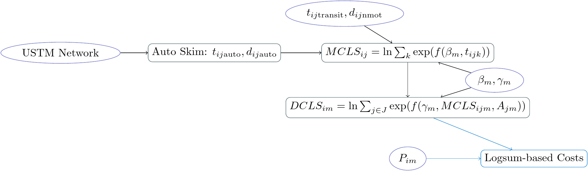

# Methodology {#methodology}

The objective of this study is to evaluate the relative systemic criticality of 
highway links on a statewide network using a model sensitive to changes in route
path, destination choice, and mode choice. We first describe the model, and then
its implementation.

## Model Design
The overall model framework is presented in Figure \@ref(fig:framework), and is
designed to capture the utility-based accessibility for a particular origin 
zones $i$ and trip purpose $m$. The model begins with a travel time skim
procedure, to determine the congested travel time from zone $i$ to zone $j$ by
auto as well as the shortest network distance for non motorized modes. The
transit travel time skim is fixed, assuming that transit infrastructure would
not be affected by changes to the highway network. Throughout this section,
lower-cased index variables $k$ belong to a set of all indices described by the
corresponding capital letter $K$

```{r framework, out.width="75%", fig.align="center", fig.cap = "Model framework.", echo = FALSE}

```

With the travel time $t_{ijk}$ for all modes $k \in K$, the model computes
mode choice utility values. The multinomial logit mode choice model describes
the probability of a person at origin $i$ choosing mode $k$ for a trip to
destination $j$:
\begin{equation}
\mathcal{P}_{ijm}(k) = \frac{\exp(f(\beta_{m}, t_{ijk}))}{\sum_{K}\exp(f(\beta_{m}, t_{ijk}))}
  (\#eq:mcp)
\end{equation}
The log of the denominator of the this equation is called the 
mode choice logsum, $MCLS_{ijm}$ and is a measure of the travel cost by all 
modes, weighted by utility parameters $\beta_m$ that may vary by trip purpose.

The $MCLS$ is then used as a travel impedance term in the multinomial logit 
destination choice model, where the probability of a person at origin $i$
choosing destination $j \in J$ is
\begin{equation}
\mathcal{P}_{im}(j) = \frac{\exp(f(\gamma_{m}, MCLS_{ijm}, A_j))}{\sum_{J}\exp(f(\gamma_{m}, MCLS_{ijm}, A_j))}
  (\#eq:dcp)
\end{equation}
where $A_j$ is the attractiveness --- represented in terms of socioeconomic activity
--- of zone $j$. As with mode choice, the log of the denominator of this model is the destination
choice logsum, $DCLS_{im}$. This quantity represents the value access to all destinations
by all modes of travel, and varies by trip purpose. 

The $DCLS_{im}$ measure is relative, but can be compared across scenarios. The 
difference between the measures of two scenarios 
\begin{equation}
\Delta_{im} = DCLS_{im}^{\mathrm{Base}} - DCLS_{im}^{\mathrm{Scenario}}
  (\#eq:deltas)
\end{equation}
however, provides an estimate of the accessibility lost when $t_{ij\mathrm{drive}}$
changes due to a damaged highway link. This accessibility change is *per trip*, 
meaning that the total lost accessibility is $P_{im} * \Delta_{im}$ where $P$ is
the number of trip productions at zone $i$ for purpose $m$. This measure is
given in units of dimensionless utility, but the mode choice cost coefficient 
$\beta$ provides a conversion factor between utility and cost. The total financial
cost of a damaged link for the entire region for all trip purposes is
\begin{equation}
\mathrm{Cost} = \sum_{I}\sum_{M} -1 / \beta_{\mathrm{cost},m} * P_{im} \Delta_{im}
  (\#eq:totalcost)
\end{equation}

For comparison to a simpler resiliency method that only includes the increased
travel time between origins and destinations, we compute the change in travel
time between $\delta t_{ij}$ and multiply the number of trips by this change 
and a value of time coefficient derived from the cost and vehicle time coefficients
of the mode choice model,
\begin{equation}
\mathrm{Cost}' =  \sum_I \sum_J \sum_M \frac{\beta_{\mathrm{time}, m} }{\beta_{\mathrm{cost}, m}} T_{ijm} t_{ijm}
  (\#eq:ttmethod)
\end{equation}


## Model Implementation in Utah
The Utah Department of Transportation (UDOT) manages an extensive highway
network consisting of interstate freeways (I-15, I-80, I-70, and I-84),
intraurban expressways along the Wasatch Front, and rural highways throughout
the state. The rugged mountain and canyon topography throughout the state places
severe constraints on possible redundant paths in the highway network. A
landslide or rock fall in any single canyon may isolate a community or force a
redirection of traffic that could be several hours longer than the preferred
route; understanding which of these many possible choke points is most critical is a key
and ongoing objective of the agency.

Several data elements for the model described above were obtained from the Utah
Statewide Travel Model (USTM). USTM is a trip-based statewide model that is
focused exclusively on long-distance and rural trips: intraurban trips within
existing Metrpolitan Planning Organization (MPO) model regions are pre-loaded 
onto the USTM highway network. This means that USTM as currently constituted can
be used for infrastructure planning purposes, but would be inadequate to 
evaluate the systemic resiliency of the highway network given the disparate
methodologies of the MPO models. USTM can, however, provide the following 
data elements

   1.	*Highway Network*: including free flow and congested travel speeds, 
   link length, link capacity estimates, etc.
   2.	*Zonal Productions* $P_{im}$: available for all zones by purpose, 
   including those in the MPO region areas.
   3.	*Zonal Socioeconomic Data*: the destination choice model described in
   Equation \@ref(eq:dcp) calculates attractions $A_{jm}$ from the USTM zonal
   socioeconomic data based on the utility coefficients in \@ref(tab:coeffs).
   4. *Calibration Targets*: USTM base scenario estimates of mode split and
   trip length were used to calibrate the utility coefficients as described 
   below.

Among MPO models in Utah, only the model jointly operated by the 
Wasatch Front Regional Council (WFRC, Salt Lake area MPO) and the  
Mountainland Association of Governments (MAG, Provo area MPO) model include a 
substantive transit forecasting component. The transit travel time skim from the 
WFRC / MAG model was used for the mode choice model in Equation \@ref(eq:mcp); 
the zonal travel time between the smaller WFRC / MAG model zones was averaged 
to the larger USTM zones, and the minimum time among the several modes available
(commuter rail, light rail, bus rapid transit, local bus) was taken as the travel
time for a single transit mode in this implementation.

```{r coeffs}
tar_load(coefficient_table)

kbl(coefficient_table, caption = "Choice Model Coefficients", booktabs = TRUE,
    col.names = c("Model", "Variable", "HBW", "HBO", "NHB"), digits = 4) %>%
  kable_styling() %>%
  collapse_rows(1:2, row_group_label_position = 'stack', latex_hline = "major")
```

The utility coefficients for the destination and mode choice models are
presented in Table \@ref(tab:coeffs). The mode choice coefficients were adapted
from USTM and supplemented with coefficients from the Roanoke (Virginia)
Valley Transportation Planning Organization (RVTPO) travel model. This model was
selected for its simplicity and analogous data elements to the proposed model.
The alternative-specific constants were calibrated to regional mode choice
targets developed from the 2015 Utah Household Travel Survey (UHTS) using 
methods described by @koppelman2006.
The destination choice utility equation consists of three parts: a size term, 
a travel impedance term, and a calibration polynomial. Coefficients for the
size term and travel impedance terms were adapted from the Oregon
Statewide Integrated Model (SWIM) for all purposes except HBW. Instead, these coefficients were 
adapted from the RVTPO model. The distance polynomial coefficients were 
calibrated to targets developed from UHTS.

### Vulnerable Link Identification
To develop evaluation scenarios on which to apply the model, we used information
contained in the UDOT Risk Priority Analysis online map [CITATION]. This map
considers the probability of various events that could impact road performance 
including rock falls, avalanches, landslides, and other similar occurrences.
The map indicated 41 non-redundant highway facilities on which to apply the model.

